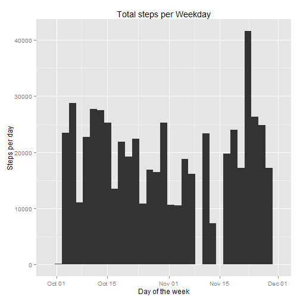
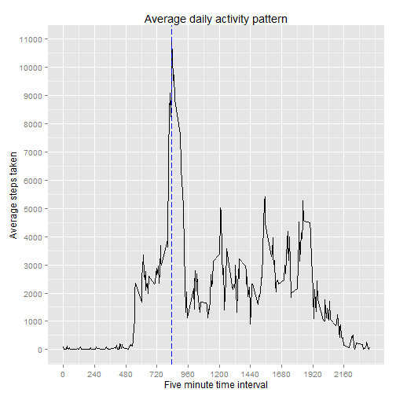
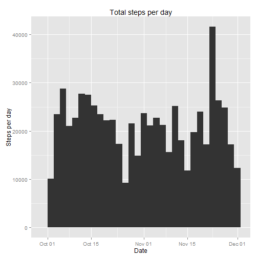
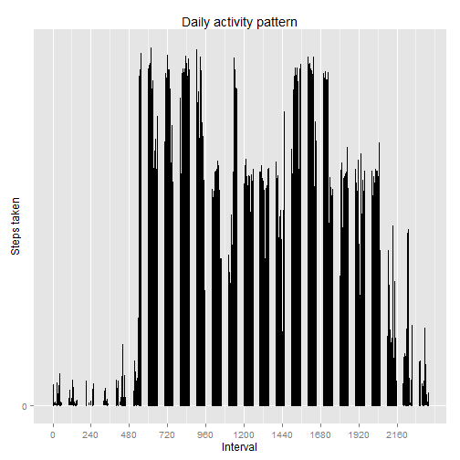

 Operating system:Windows 7  
 R version: 3.1.2  
 
### Loading and preprocessing the data  
 


```r
###Load Libraries
suppressMessages(library(dplyr))
library(tidyr)
library(ggplot2)
library(lubridate)
###set working directory 
setwd("~/Coursera/Reproducible research/Peer Assessment-1")
### Needed to work with windows
setInternet2(use = TRUE)
url = "https://d396qusza40orc.cloudfront.net/repdata%2Fdata%2Factivity.zip"
destfile="repdata_data_activity.zip" 
download.file(url, destfile, mode = "wb", cacheOK = TRUE, method = "auto")
unzip("repdata_data_activity.zip")
amData <- read.csv("activity.csv" )
data <- tbl_df(amData)
data$date <- ymd(data$date)
```

### Total and average of steps taken per day


```r
sumstepsday <- aggregate(steps ~ date, data = data, sum)
sumstepsday <- mutate(sumstepsday, wday = wday(sumstepsday$date, label = TRUE))
sumstepsweekday <- aggregate(steps ~ wday, data = sumstepsday, sum)
meanStepsDay <- as.integer(mean(sumstepsday$steps))
medianStepsDay <- as.integer(median(sumstepsday$steps))
sg <- ggplot(data = sumstepsday, aes(x = date)) + ylab("Steps per day")
sg <- sg + geom_histogram(aes(weights=steps, fill=date))
#sg <- sg + geom_hline(aes(yintercept=meanStepsDay, color = "mean"))
#sg <- sg + geom_hline(aes(yintercept=medianStepsDay, color = "median"))
sg <- sg + scale_fill_brewer(palette = "Dark2")
sg <- sg + xlab("Day of the week")
sg <- sg + ggtitle("Total steps per Weekday")
sg
```

```
## stat_bin: binwidth defaulted to range/30. Use 'binwidth = x' to adjust this.
```

 

Mean steps taken per day: 10766  
median steps taken per day: 10765  

### What is the average daily activity pattern?


```r
FiveMInterval <- aggregate(steps ~ interval, data = data, sum)
maxSteps <- range(FiveMInterval)[2]
maxInterval <- filter(FiveMInterval, steps == maxSteps)$interval
FMG <- ggplot(FiveMInterval, aes(x = interval, y = steps)) + xlab("Five minute time interval") + ylab("Average steps taken")
FMG <- FMG + geom_line() 
FMG <- FMG + geom_vline(xintercept = maxInterval,  linetype = "longdash", color = "blue")
FMG <- FMG + scale_x_continuous(breaks=seq(0,2355,240))
FMG <- FMG + scale_y_continuous(breaks=seq(0,12000,1000))
FMG <- FMG + ggtitle("Average daily activity pattern")
FMG
```

 

Interval 835 on average across all of the days in the dataset contains the maximum step count of 10927  


### Imputing missing values
Missing value have been replaced with the average for that weekday.

```r
naCount <- sum(is.na(data))
meanstepsweekday <- aggregate(steps ~ wday, data = sumstepsday, mean)
naDays <- unique(select(subset(data, is.na(steps)), date))
naDays <- mutate(naDays, wday = wday(naDays$date, label = TRUE))
naDays <- select(merge(naDays, meanstepsweekday), date, steps, wday)
modifiedsumstepsday <- rbind(sumstepsday, naDays)
modifiedsumstepsday <- modifiedsumstepsday[order(as.Date(modifiedsumstepsday$date)), ]
meanmodStepsDay <- as.integer(mean(modifiedsumstepsday$steps))
medianmodStepsDay <- as.integer(median(modifiedsumstepsday$steps))
msg <- ggplot(data = modifiedsumstepsday, aes(x = date)) + ylab("Steps per day")
msg <- msg + geom_histogram(aes(weights=steps, fill=date))
#msg <- msg + geom_hline(aes(yintercept=meanmodStepsDay, color = "Mean steps"))
#msg <- msg + geom_hline(aes(yintercept=medianmodStepsDay, color = "Median steps"))
msg <- msg + xlab("Date")
msg <- msg + ggtitle("Total steps per day")
msg
```

```
## stat_bin: binwidth defaulted to range/30. Use 'binwidth = x' to adjust this.
```

 
Number of NAs in the data: 2304
Modified Mean steps taken per day: 10821  
Modified median steps taken per day: 11015   

These values differ slightly from the first estimates. 
This does seem to change the actual nature of the data collecte

### Are there differences in activity patterns between weekdays and weekends?


```r
weekdaydif <- modifiedsumstepsday
weekDay <- filter(weekdaydif, wday == "Mon" | wday == "Tues" | wday == "Wed" | wday == "Thurs" | wday == "Fri")
weekDay <- mutate(weekDay, daytype = "weekday")
weekEnd <- filter(weekdaydif, wday == "Sun" | wday == "Sat" )
weekEnd <- mutate(weekEnd, daytype = "weekend")
modifiedsumstepsday <- rbind(weekDay, weekEnd)
modifiedsumstepsday <- select(modifiedsumstepsday, date, steps, daytype)
WMG <- ggplot(data, aes(x = interval, y = steps)) + xlab("Interval") + ylab("Steps taken")
WMG <- WMG + geom_line() 
WMG <- WMG + scale_x_continuous(breaks=seq(0,2355,240))
WMG <- WMG + scale_y_continuous(breaks=seq(0,12000,1000))
WMG <- WMG + ggtitle("Daily activity pattern")
WMG
```

```
## Warning: Removed 2 rows containing missing values (geom_path).
```

 
